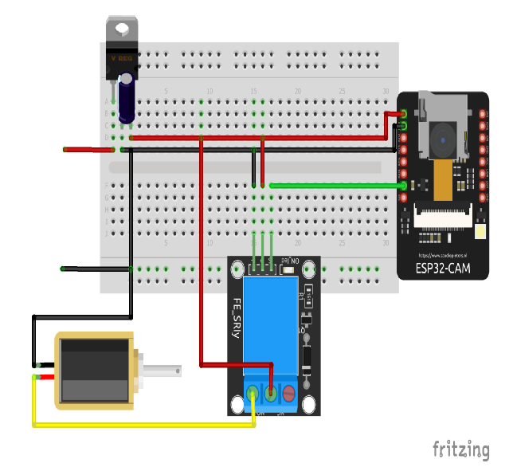
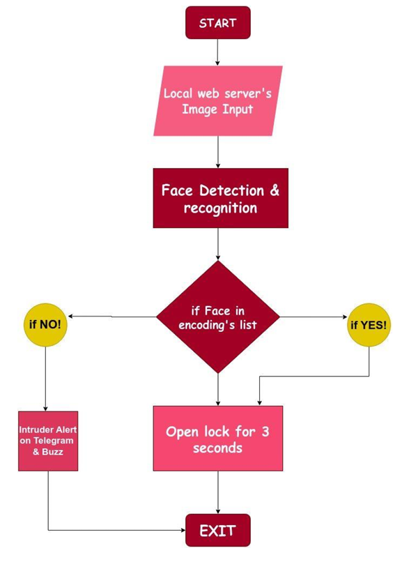
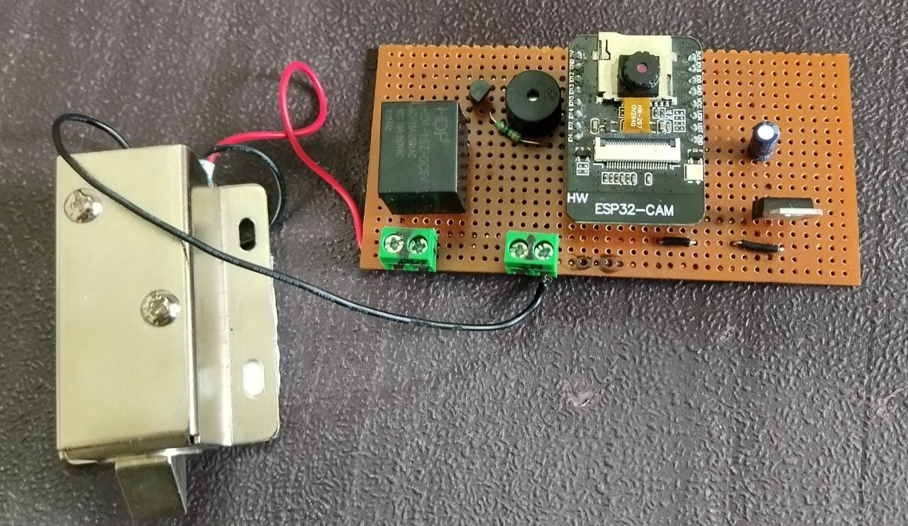

---

# ESP32-CAM Security System (CamVisioTech MK0)

## Project Overview

This project implements a Face Recognition & Alerting System using the ESP32-CAM module, designed for Task 4 of the IoT Workshop-1 (ECL 108). The system utilizes facial recognition to control a solenoid lock, unlocking the door for 3 seconds when a known person is recognized. If an intruder is detected, the system sends an alert via Telegram and activates a buzzer. Additionally, the system offers a web-based interface for monitoring and control, and a custom desktop application built with Python, Tkinter, and CustomTkinter to manage both the facial recognition and alert system.

---

## Features

- **Face Recognition:** Captures and processes images via the ESP32-CAM and compares them against pre-stored face encodings.
- **Door Control:** Utilizes a solenoid lock controlled via a relay to lock/unlock the door based on successful face recognition.
- **Intruder Alert System:** Sends the intruder’s image to the user’s Telegram account and sounds an alarm if an unauthorized face is detected.
- **Web Interface:** Allows real-time streaming of video feed and control of the door lock and buzzer through a web-based interface.
- **Python-based GUI:** Includes both a high-latency (old-school) and low-latency modern Python GUI for user-friendly system control.
- **Hardware Enhancements:** Includes heat sinks to reduce heat generated by the ESP32-CAM module.

---

## Hardware Components

- **ESP32-CAM Board**: Wi-Fi-enabled microcontroller with an integrated camera.
- **Solenoid Lock (12V)**: Electronic lock controlled by a relay.
- **Relay (5V, 10A)**: Controls the solenoid lock.
- **IC-7805**: Voltage regulator that ensures a constant 5V power supply.
- **Buzzer**: Provides an audible alert in case of an intruder detection.
- **Additional Components**: 
  - Diode (1N4007)
  - NPN Transistor (BC547)
  - Resistors (330Ω)
  - Capacitor (100μF)

---

## Software Requirements

- **Arduino IDE**: For uploading code to the ESP32-CAM module.
- **Python**: For running the GUI and integrating face recognition.
  - Libraries: `opencv-python`, `face_recognition`, `requests`, `tkinter`, `customtkinter`, `numpy`, `Pillow`
- **Telegram Bot**: For sending notifications in case of an intruder alert.

---

## Project Structure

```bash
ESP32-CAM-Security/
│
├── ArduinoSketch/                # Folder for Arduino code
│   ├── debug.cfg
│   ├── debug_custom.json
│   ├── esp32.svd
│   └── finalCamProj.ino          # Main Arduino sketch controlling ESP32-CAM
│
├── guiTest.py                    # Old-school GUI with high latency
├── guiNew.py                     # Modern GUI with lower latency
├── LICENSE                       # Project license
├── README.md                     # Project documentation
├── final_setup.jpeg              # Final project setup image
├── ckt.png                       # Circuit diagram
├── flowchart.png                 # Flowchart illustrating system process
└── task4.pdf                     # Project report
```

---

## Setup Instructions

### 1. ESP32-CAM Setup

1. **Install ESP32 Board Manager** in Arduino IDE:
   - Go to **File > Preferences** and add the URL:  
     `https://dl.espressif.com/dl/package_esp32_index.json`
   - Go to **Tools > Board > Board Manager** and install the ESP32 package.

2. **Connections**:
   - Connect the ESP32-CAM with a TTL programmer.
   - Interface the **solenoid lock** with the relay module and connect the ESP32 GPIO to control it.
   - Connect the **buzzer** to an ESP32 GPIO pin for intruder alerts.

3. **Upload Code**:
   - Use the provided `finalCamProj.ino` file located in the `ArduinoSketch/` directory.
   - Set your Wi-Fi credentials in the code:  
     ```cpp
     const char* WIFI_SSID = "your_ssid";
     const char* WIFI_PASS = "your_password";
     ```

4. **Access the Web Interface**:
   - Once the ESP32-CAM is connected, visit `http://<ESP32_IP_ADDRESS>/` to access the video feed and control panel.

### 2. Python GUI Setup

1. **Install Python dependencies**:
   ```bash
   pip install opencv-python face_recognition requests pillow customtkinter numpy
   ```

2. **Configure the GUI**:
   - Modify the `path` in the Python script to point to the folder containing known face images.
   - Ensure your ESP32 IP address is correctly set in the GUI for interaction with the hardware.

3. **Run the GUI**:
   - Run `guiNew.py` or `guiTest.py` depending on your latency preference.
   - The GUI will allow you to monitor the video feed and receive real-time notifications in case of intruder detection.

---

## Circuit Diagram

Here is the circuit diagram showing the connections for the ESP32-CAM, solenoid lock, buzzer, and other components:

<p align="center">
  
</p>

---

## Flowchart

Below is the flowchart that illustrates the system's working process:

<p align="center">
  
</p>

1. **Start**: The system begins by powering up the ESP32-CAM and initializing the network connection.
2. **Image Capture**: The ESP32-CAM captures the user's face image.
3. **Face Recognition**: The system compares the captured image with stored face encodings.
4. **Match Found**:
   - If a match is found, the solenoid lock is triggered to unlock the door for 3 seconds.
5. **No Match**:
   - If no match is found, the system identifies the person as an intruder and:
     - Sends the intruder’s image via Telegram.
     - Activates the buzzer for 1.5 seconds as an alert.
6. **End**: The system returns to the start, ready for the next user.

---

## Final Setup

Below is the image of the final setup of the ESP32-CAM security system:



---

## How It Works

1. **Face Recognition**:
   - The ESP32-CAM captures images at regular intervals and sends them to the server.
   - The server compares the captured images with pre-stored face encodings to authenticate users.

2. **Intruder Detection**:
   - If a face does not match the stored faces, the system triggers an intruder alert.
   - An image of the intruder is sent to the user’s Telegram account.
   - The buzzer is activated for 1.5 seconds as a local alert.

3. **Web Interface**:
   - The web interface allows users to:
     - View the real-time camera feed at different resolutions.
     - Control the solenoid lock (unlock for 3 seconds).
     - Trigger the buzzer manually if needed.

---

## Demo

- [CamVisioTech MK0 - ESP32-CAM Security System Demo](https://www.instagram.com/p/CvfpnTPIu1L/)

---

## References

1. ESP32-CAM Documentation: https://github.com/espressif/esp32-camera
2. Solenoid Lock Guide: https://www.s4a-access.com/dc12v-magnetic-solenoid-lock-for-smart-storage-cabinet_p307.html
3. Face Recognition: https://github.com/ageitgey/face_recognition

---

## License

This project is licensed under the MIT License - see the [LICENSE](LICENSE) file for details.

---

By following the setup and usage instructions, you'll be able to deploy a fully functional security system using the ESP32-CAM with both face recognition and intruder alert capabilities.
